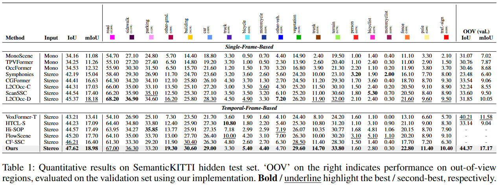
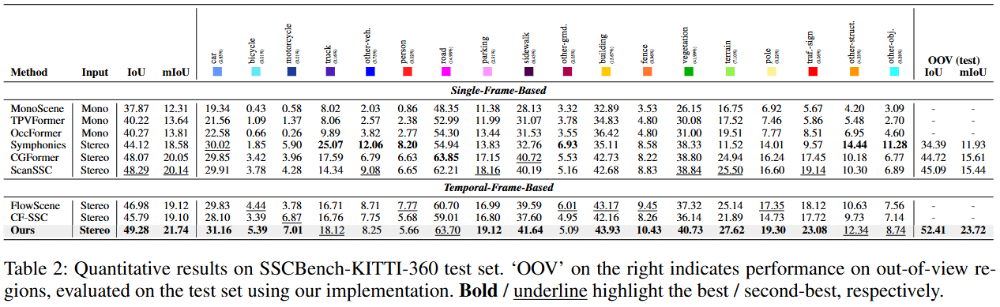

# TFFormer_C3D
---
# Towards Temporal Fusion Beyond the Field of View for Caemra-based Semantic Scene Completion

##  News
---
- [2025/11/20] Code release
- [2025/11/17] [**arXiv**](https://arxiv.org/pdf/2405.13675v4) preprint released
- [2025/11/08] Our paper has been accepted to AAAI2026!

## Introduction

Recent camera-based 3D semantic scene completion (SSC) methods have increasingly explored leveraging temporal cues to enrich the features of the current frame. However, while these approaches primarily focus on enhancing in-frame regions, they often struggle to reconstruct critical out-of-frame areas near the sides of the ego-vehicle, although previous frames commonly contain valuable contextual information about these unseen regions. To address this limitation, we propose the Current-Centric Contextual 3D Fusion (C3DFusion) module, which generates hidden region-aware 3D feature geometry by explicitly aligning 3D-lifted point features from both current and historical frames. C3DFusion performs enhanced temporal fusion through two complementary techniques—historical context blurring and current-centric feature densification—which suppress noise from inaccurately warped historical point features by attenuating their scale, and enhance current point features by increasing their volumetric contribution. Simply integrated into standard SSC architectures, C3DFusion demonstrates strong effectiveness, significantly outperforming state-of-the-art methods on the SemanticKITTI and SSCBench-KITTI-360 datasets. Furthermore, it exhibits robust generalization, achieving notable performance gains when applied to other baseline models.

## Method


Schematics and detailed architectures of CGFormer. (a) The framework of the proposed CGFormer for camera-based semantic scene completion. The pipeline consists of the image encoder for extracting 2D features, the context and geometry aware voxel (CGVT) transformer for lifting the 2D features to 3D volumes, the 3D local and global encoder (LGE) for enhancing the 3D volumes and a decoding head to predict the semantic occupancy. (b) Detailed structure of the context and geometry aware voxel transformer. (c) Details of the Depth Net.

## Quantitative Results





## Getting Started

step 1. Refer to [install.md](./docs/install.md) to install the environment.

step 2. Refer to [dataset.md](./docs/dataset.md) to prepare SemanticKITTI and KITTI360 dataset.

step 3. Refer to [train_and_eval.md](./docs/train_and_eval.md) for training and evaluation.

step 4. Refer to [visualize.md](./docs/visualization.md) for visualization.

## Model Zoo

We provide the pretrained weights on SemanticKITTI and KITTI360 datasets, reproduced with the released codebase. The pretrained checkpoint efficientnet-seg-depth can be download from [here](https://github.com/pkqbajng/CGFormer/releases/download/v1.0/efficientnet-seg-depth.pth). All the checkpoints for our method and training log for two datasets can be found [here](https://github.com/pkqbajng/CGFormer/releases/tag/v1.0).


|                           Dataset                            |    Backbone    |        IoU         |        mIoU        |                        Model Weights                         |                        Training Logs                         |
| :----------------------------------------------------------: | :------------: | :----------------: | :----------------: | :----------------------------------------------------------: | :----------------------------------------------------------: |
| [SemanticKITTI](configs/CGFormer-Efficient-Swin-SemanticKITTI.py) | EfficientNetB7 | 44.41, 45.99 (val) | 16.63, 16.89 (val) | [Link](https://github.com/pkqbajng/CGFormer/releases/download/v1.0/CGFormer-Efficient-Swin-SemanticKITTI.ckpt) | [Link](https://github.com/pkqbajng/CGFormer/releases/download/v1.0/CGFormer-Efficient-Swin-SemanticKITTI.zip) |
|   [KITTI360](configs/CGFormer-Efficient-Swin-KITTI360.py)    | EfficientNetB7 |       48.07        |       20.05        | [Link](https://github.com/pkqbajng/CGFormer/releases/download/v1.0/CGFormer-Efficient-Swin-KITTI360.ckpt) | [Link](https://github.com/pkqbajng/CGFormer/releases/download/v1.0/CGFormer-Efficient-Swin-KITTI360.zip) |

## Acknowledgement

Many thanks to these exceptional open source projects:
- [BEVFormer](https://github.com/fundamentalvision/BEVFormer)
- [mmdet3d](https://github.com/open-mmlab/mmdetection3d)
- [MonoScene](https://github.com/astra-vision/MonoScene)
- [semantic-kitti-api](https://github.com/PRBonn/semantic-kitti-api) 
- [MobileStereoNet](https://github.com/cogsys-tuebingen/mobilestereonet)
- [Symphonize](https://github.com/hustvl/Symphonies.git)
- [DFA3D](https://github.com/IDEA-Research/3D-deformable-attention.git)
- [VoxFormer](https://github.com/NVlabs/VoxFormer.git)
- [OccFormer](https://github.com/zhangyp15/OccFormer.git)

As it is not possible to list all the projects of the reference papers. If you find we leave out your repo, please contact us and we'll update the lists.

## Bibtex

If you find our work beneficial for your research, please consider citing our paper and give us a star:

```

@inproceedings{CGFormer,
 title = {Context and Geometry Aware Voxel Transformer for Semantic Scene Completion},
 author = {Yu, Zhu and Zhang, Runmin and Ying, Jiacheng and Yu, Junchen and Hu, Xiaohai and Luo, Lun and Cao, Si-Yuan and Shen, Hui-liang},
 booktitle = {Advances in Neural Information Processing Systems},
 pages = {1531--1555},
 volume = {37},
 year = {2024}
}
```

If you encounter any issues, please contact zhu.yu.pk@gmail.com.
>>>>>>> 4610ce4 (Upload source code)
