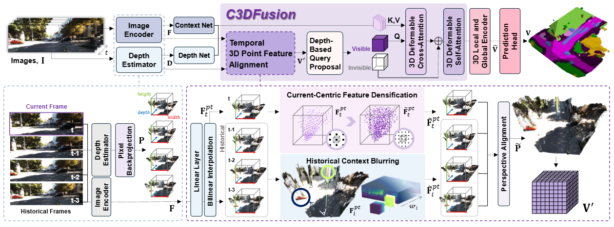

# Towards Temporal Fusion Beyond the Field of View for Caemra-based Semantic Scene Completion

##  News
---
- [2025/11/20] Code release
- [2025/11/17] [**arXiv**](https://arxiv.org/pdf/2405.13675v4) preprint released
- [2025/11/08] Our paper has been accepted to AAAI2026!

## Introduction

Recent camera-based 3D semantic scene completion (SSC) methods have increasingly explored leveraging temporal cues to enrich the features of the current frame. However, while these approaches primarily focus on enhancing in-frame regions, they often struggle to reconstruct critical out-of-frame areas near the sides of the ego-vehicle, although previous frames commonly contain valuable contextual information about these unseen regions. To address this limitation, we propose the Current-Centric Contextual 3D Fusion (C3DFusion) module, which generates hidden region-aware 3D feature geometry by explicitly aligning 3D-lifted point features from both current and historical frames. C3DFusion performs enhanced temporal fusion through two complementary techniques—historical context blurring and current-centric feature densification—which suppress noise from inaccurately warped historical point features by attenuating their scale, and enhance current point features by increasing their volumetric contribution. Simply integrated into standard SSC architectures, C3DFusion demonstrates strong effectiveness, significantly outperforming state-of-the-art methods on the SemanticKITTI and SSCBench-KITTI-360 datasets. Furthermore, it exhibits robust generalization, achieving notable performance gains when applied to other baseline models.

## Method



An overview of our model, highlighting the proposed C3DFusion. The symbol '⊕' denotes feature concatenation.

## Quantitative Results


## Getting Started

step 1. Refer to [install.md](./docs/install.md) to install the environment.

step 2. Refer to [dataset.md](./docs/dataset.md) to prepare SemanticKITTI and KITTI360 dataset.

step 3. Refer to [train_and_eval.md](./docs/train_and_eval.md) for training and evaluation.

step 4. Refer to [visualize.md](./docs/visualization.md) for visualization.

## Model Zoo

We provide the pretrained weights on SemanticKITTI and KITTI360 datasets, reproduced with the released codebase. The pretrained checkpoint efficientnet-seg-depth can be download from [here](https://github.com/pkqbajng/CGFormer/releases/download/v1.0/efficientnet-seg-depth.pth). All the checkpoints for our method and training log for two datasets can be found [here](https://github.com/pkqbajng/CGFormer/releases/tag/v1.0).


|                           Dataset                            |    Backbone    |        IoU         |        mIoU        |                        Model Weights                         |
| :----------------------------------------------------------: | :------------: | :----------------: | :----------------: | :----------------------------------------------------------: |
| [SemanticKITTI](configs/TFFormer-Efficient-Swin-SemanticKITTI.py) | EfficientNetB7 | 47.62, 49.53 (val) | 18.98, 19.31 (val) | [Link](https://drive.google.com/drive/folders/1IVSj7-NdDR8rAugpmJfrGFgbBijZ6tgM?usp=drive_link) |
|   [KITTI360](configs/TFFormer-Efficient-Swin-KITTI360.py)    | EfficientNetB7 |       49.28        |       21.74        | [Link](https://drive.google.com/drive/folders/1MT-L-FcO3wOESllupLPz93ZA9oj_Swfl?usp=drive_link) |

## Acknowledgement

Many thanks to these exceptional open source projects:
- [BEVFormer](https://github.com/fundamentalvision/BEVFormer)
- [mmdet3d](https://github.com/open-mmlab/mmdetection3d)
- [MonoScene](https://github.com/astra-vision/MonoScene)
- [semantic-kitti-api](https://github.com/PRBonn/semantic-kitti-api) 
- [MobileStereoNet](https://github.com/cogsys-tuebingen/mobilestereonet)
- [Symphonize](https://github.com/hustvl/Symphonies.git)
- [DFA3D](https://github.com/IDEA-Research/3D-deformable-attention.git)
- [VoxFormer](https://github.com/NVlabs/VoxFormer.git)
- [OccFormer](https://github.com/zhangyp15/OccFormer.git)
- [CGFormer](https://github.com/pkqbajng/CGFormer.git)

As it is not possible to list all the projects of the reference papers. If you find we leave out your repo, please contact us and we'll update the lists.

## Bibtex

If you find our work beneficial for your research, please consider citing our paper and give us a star:

```

@article{bae2025towards,
  title={Towards Temporal Fusion Beyond the Field of View for Camera-based Semantic Scene Completion},
  author={Bae, Jongseong and Ha, Junwoo and Heo, Jinnyeong and Lee, Yeongin and Kim, Ha Young},
  journal={arXiv preprint arXiv:2511.12498},
  year={2025}
}
```

If you encounter any issues, please contact gkwnsdn1130@gmail.com
